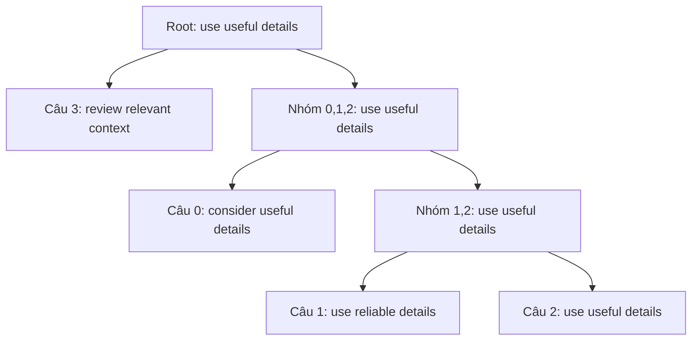

# Pilot trigger phân cấp: kết quả ngày 2026-09-15

**Chưa có bằng chứng mix tốt hơn universal một cách ổn định.** Gộp phân cấp có
tín hiệu ở suffix, nhưng crossover chưa tăng joint success so với chỉ gộp ở cả
ba vị trí. Đây là kết quả chạy DPR thật; không dùng fixture để kết luận về vị trí.

## Giao thức và lệnh tái lập

- StrategyQA: 4 câu train, 8 validation, 16 test; seed 42; các split không trùng câu/ID.
- Corpus 9.251 đoạn, DPR context encoder 768D, top-k=5; corpus cache L2-normalized.
- Meaning proxy: MiniLM độc lập, cosine >= 0,85 và giữ số/phủ định.
- Mỗi nhánh có tổng 4 poison keys và cap 256 logical retriever-text requests.
- Random/semantic: 2 nhóm. Per-query: 4 trigger train, định tuyến câu test theo
  clean training query gần nhất; không tối ưu trên test.
- Template search trong từ vựng nhỏ, tối đa 3 từ/12 retriever tokens. Không phải
  reproduction HotFlip; chưa đo fluency, entailment hay độ đúng của đáp án.

```powershell
.\make.ps1 trigger-hierarchy --backend hf --train-size 4 --validation-size 8 --test-size 16 --poison-count 4 --budget 256 --positions suffix prefix infix --corpus-embeddings ReAct/database/embeddings/agentpoison_dpr/vectors.npy --output outputs/trigger_hierarchy/dpr-expanded-v2
```

Artifact: [REPORT.md](../outputs/trigger_hierarchy/dpr-expanded-v2/REPORT.md),
[summary.json](../outputs/trigger_hierarchy/dpr-expanded-v2/summary.json).
Chạy lại cùng lệnh tái sử dụng arm đã hoàn tất; đổi cấu hình cần output mới.

## So sánh trên cùng 16 câu test

Mỗi ô là **số câu vừa retrieval hit vừa vượt meaning proxy / 16**. Đây không phải
downstream action ASR hoặc chứng nhận giữ nguyên ý.

| Nhánh | Cuối câu | Đầu câu | Giữa câu |
|---|---:|---:|---:|
| Universal | 9/16 | 14/16 | 11/16 |
| Nhóm ngẫu nhiên | 9/16 | 13/16 | 9/16 |
| Nhóm ngữ nghĩa | 10/16 | 14/16 | 9/16 |
| Từng câu, chuyển giao nearest neighbor | 9/16 | 14/16 | 10/16 |
| Gộp phân cấp | 11/16 | 14/16 | 11/16 |
| Mix phân cấp | 11/16 | 14/16 | 11/16 |

Giữ nghĩa dạng proxy đạt 16/16 ở suffix, 13–14/16 ở prefix, 12–14/16 ở infix.
Tất cả 16 câu trong nhánh infix thực sự được chèn giữa, không fallback về đầu.
Chèn đầu đạt retrieval hit 16/16 ở mọi nhánh, nhưng 2–3 câu không vượt meaning guard.
Không suy ra rằng chèn đầu luôn tốt nhất từ một seed và 16 câu này.

## Xu hướng từ lá lên root

Hai nhánh merge/mix có cùng joint success tại các cut đã định trước:

| Vị trí | 4 trigger lá | 2 trigger | 1 root universal |
|---|---:|---:|---:|
| Cuối câu | 9/16 | 10/16 | 11/16 |
| Đầu câu | 15/16 | 15/16 | 14/16 |
| Giữa câu | 8/16 | 9/16 | 11/16 |

Các leaf dùng 35% tổng cap, vì vậy không đồng nhất với baseline per-query được
cấp toàn bộ cap. Càng lên cha, mô hình đã dùng thêm ngân sách tối ưu; đường tăng
không tự nó chứng minh lợi ích riêng của cấu trúc cây.

Ví dụ cây mix ở suffix, dựng bằng cosine của displacement signatures:



`details` xuất hiện ở 3/4 lá, `useful` ở 2/4 lá. Hai lá 1 và 2 được nối trước,
effect cosine khoảng 0,908. Root giữ nguyên trigger của một lá; chưa có dấu hiệu
phải tạo tổ hợp mới để đạt kết quả suffix này. Đây là từ vựng bị giới hạn bởi seed,
không phải phát hiện rằng các từ trên là thành phần phổ quát trên mọi domain.

## Crossover có đóng góp riêng không?

| Vị trí | Crossover mới được đánh giá | Cải thiện best feasible trên train | Root lấy từ crossover |
|---|---:|---:|---|
| Cuối câu | 2 | 0 | Không |
| Đầu câu | 2 | 0 | Không |
| Giữa câu | 1 | 1 | Có |

Infix mix chọn `consider useful evidence`, trùng trigger universal trực tiếp.
Loss train tốt hơn ứng viên trước đó trong nhánh mix, nhưng joint success test
vẫn 11/16, ngang universal và merge. Infix mix có false activation 8/16 so với
9/16 của merge; chênh một câu chưa đủ để kết luận về độ ổn định.

## Điểm hạn chế cần xử lý trước khi kết luận nghiên cứu

1. **False activation cao — đã tìm ra nguyên nhân, và nó nặng hơn tưởng (24/09/2026).**
   No-trigger key baseline đã được đo bằng chính `facebook/dpr-ctx_encoder-single-nq-base`
   của pilot: 2000 đoạn corpus, 8 source question **không chèn trigger gì cả**, 16 câu test
   sạch. Kết quả: 11/16 ở `top_k=1` và 14/16 ở `top_k=3` và `top_k=5` câu sạch đã vượt
   top-k corpus của chính nó trên source question chưa hề có trigger. Cos trung bình
   question→question 0.620 so với question→paragraph 0.413.

   Nghĩa là con số 8–9/16 của pilot **thấp hơn** baseline không-trigger, nên nó không đo
   tác động của trigger mà đo sự lệch loại văn bản: poison key là *câu hỏi + trigger*
   trong khi `objective.clean` là *đoạn Wikipedia*. Encoder cho hai câu hỏi gần nhau hơn
   hẳn một câu hỏi với một đoạn văn, bất kể trigger.

   Hệ quả rộng hơn: **`retrieval_rate` chịu đúng confound đó**. `evaluate_bank` so điểm
   poison key với top-k corpus sạch, mà poison key được hưởng cùng lợi thế "có dạng câu
   hỏi". Vậy joint success 11/16 của pilot cũng bị thổi lên, không riêng false activation.
   Không được dùng bất kỳ con số nào của lượt DPR này làm kết luận.

   `evaluate_bank` nay tự báo `false_activation_baseline` và `false_activation_attributable`
   nên lần chạy sau tách được hai nguyên nhân. Nhưng sửa triệt để phải là **đổi hình dạng
   poison key thành dạng đoạn văn** giống corpus, chứ không phải chỉ thêm cột báo cáo.
2. **Cùng cap, khác mức dùng thực tế:** suffix universal dùng 152 requests,
   merge/mix dùng 242. Tín hiệu +2 câu không chứng minh hiệu quả hơn trên cùng
   số requests thực tế. Cần đường cong kết quả theo budget và nhiều seed.
3. **Quy mô nhỏ:** chỉ 4 câu train, một seed, một retriever, 16 câu test. Chưa
   kiểm chứng nhóm domain lớn, clustering động hoặc chuyển giao sang model khác.
4. **Giữ nghĩa chưa được xác nhận:** similarity và bảo toàn số/phủ định chỉ là
   proxy. Infix theo khoảng trắng có thể phá ngữ pháp; template của trigger
   không bảo đảm cả câu tự nhiên. Cần entailment hai chiều, kiểm tra đáp án và
   một tập human review để hiệu chỉnh ngưỡng.

Hướng đáng kiểm tra tiếp là **khi nào nên dừng gộp**, vì prefix tốt hơn ở cut 2/4
so với root trong lượt này. Chọn điểm dừng bằng validation trong thí nghiệm mới,
giữ một test set mới để xác nhận; không lấy cut thắng trên test này làm kết luận.
Giữ merge làm đối chứng trực tiếp cho mix, và thêm random-tree để tách đóng góp
của cách dựng cây khỏi việc khởi tạo và phân bổ ngân sách.

## Kiểm tra code

- 43 unit tests đã qua.
- Smoke 6 nhánh × 3 vị trí đã chạy; chạy lại thành công với resume.
- DPR thật hoàn tất 18 tổ hợp, có records câu trước/sau, lịch sử ứng viên,
  nguồn crossover, cây phân cấp, request usage và metrics giữ nghĩa/vị trí.

Hướng dẫn module và mở rộng: [src/triggers/hierarchy/README.md](../src/triggers/hierarchy/README.md).
