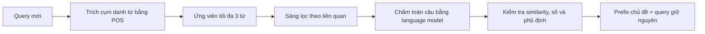

# Specificity: tạo prefix bám query bằng nội dung của chính câu đó

Module thử nghiệm **chất lượng ngôn ngữ**, không tối ưu ASR. Phương án khả quan
hiện tại là `query_adaptive`: trích cụm danh từ từ query mới, rồi chọn một prefix
ngắn theo độ liên quan, độ trôi chảy và similarity với câu gốc.

## Dùng ngay với một câu tiếng Anh

```powershell
.\make.ps1 trigger-suggest --query "Can bicycles use this lane?" --output outputs/specificity/example-bicycle.json
```

Kết quả đã chạy trên máy này:

```text
Regarding bicycles: Can bicycles use this lane?
```

Prefix là `Regarding bicycles`. Query gốc được giữ nguyên từng ký tự phía sau.
Đây là cách nhắc lại chủ đề, không bổ sung thông tin mới. `constraint_feasible`
cho biết có tìm được ứng viên đạt các ràng buộc lựa chọn không; nếu false, kết
quả là ứng viên fallback phục vụ phân tích, không phải kết quả đã đạt chuẩn.

Có thể thêm `--reference-dataset outputs/specificity/confirm-pos-v2/dataset.json`
để dùng các câu train làm đối chứng độ bám query, như trong thí nghiệm.
`--mode topic_heading` chỉ dùng cụm chủ đề; `--mode generic_language` là đối chứng
chọn trong tám seed chung. Mặc định `--mode grounded_language` thêm About/Regarding.

## Quy trình



1. POS model gán nhãn từ loại. Giữ cụm 1–2 từ kết thúc bằng NOUN/PROPN, không
   chứa động từ/trạng từ, không nối qua dấu câu hoặc cắt chuỗi tên riêng theo nhãn.
2. Sinh các prefix `About <topic>` / `Regarding <topic>` cùng seed chung để fallback.
3. Giới hạn 3 từ và 12 tokens của encoder lựa chọn. Mỗi lần fit chấm LM tối đa
   20 ứng viên, sau bước sàng lọc embedding; toàn bộ candidate pool vẫn được encode.
4. Điểm lựa chọn: mean relevance + 0,25 × min relevance + 0,25 × contrast với
   câu ngoài nhóm − 0,25 × phần NLL tăng so với câu gốc.
5. Feasible: similarity original/altered tối thiểu 0,85; PPL ratio trung bình
   nhân tối đa 1,5; giữ số/phủ định. Ứng viên theo chủ đề cần cosine với **mọi**
   câu trong nhóm ít nhất 0,15. Seed chung được miễn điều kiện topic coverage.
6. Renderer viết hoa ký tự đầu prefix, thêm `: ` rồi nối nguyên query. Chỉ đánh
   giá prefix trong module này; không chèn vào giữa câu.

Các ngưỡng là lựa chọn thực nghiệm, chưa được hiệu chỉnh bằng human review.
POS model vẫn có thể gán sai nhãn hoặc cho cụm chưa đầy đủ; các kiểm tra trên
không bảo đảm ngữ pháp/ý nghĩa trong mọi trường hợp. Chỉ hỗ trợ thí nghiệm tiếng
Anh với model hiện tại. Không dùng kết quả này để kết luận về prompt tiếng Việt.

## So sánh và tái lập lượt xác nhận

```powershell
.\make.ps1 trigger-specificity --source outputs/trigger_hierarchy/three-levels-12q-seed42 --output outputs/specificity/confirm-pos-v2 --seed 2027 --exclude-evaluated outputs/specificity/explore-v1/dataset.json
```

`--source` là lượt có ba bank universal/semantic/per_query ở vị trí prefix.
`--exclude-evaluated` nhận các dataset.json của lượt specificity đã xem trước
đó để không dùng lại câu của chúng làm fresh test. Không dùng dataset fixture.
Đổi dữ liệu/cấu hình cần output mới. Lệnh thí nghiệm hiện chạy lại các bước khi
gọi lại, nhưng **mỗi `Selector.fit` được checkpoint** vào `fit_cache.json` trong
thư mục output: chạy lại sẽ nạp lại các fit đã có và chỉ tính phần còn thiếu. Mức mịn
là từng query/nhóm, chưa phải từng candidate. Runner hierarchy resume theo arm.

Thí nghiệm giữ router DPR và train/validation cũ; lấy 48 câu test mới ngoài các
split đã biết. Chốt phương án trên 8 câu validation trước khi đọc điểm test.
Mỗi scope có các đối chứng:

| Variant | Thay đổi |
|---|---|
| `legacy_raw` | Trigger cũ, renderer cũ |
| `legacy_heading` | Trigger cũ, chỉ sửa viết hoa/dấu hai chấm |
| `generic_language` | Chọn lại seed chung theo objective ngôn ngữ |
| `grounded_language` | Thêm ứng viên từ nội dung train; bank cố định khi test |
| `topic_heading` | Chủ đề trích nguyên văn, không About/Regarding; đối chứng lặp từ |
| `per_query/query_adaptive` | Sinh/chọn ứng viên theo từng query đang đến |

`query_adaptive` có chi phí tìm kiếm lúc inference. Không coi đây là cùng ngân
sách inference với bank cố định hoặc chỉ định tuyến nearest neighbor.

## Models và cache

- Lựa chọn: `sentence-transformers/all-MiniLM-L6-v2` và `distilbert/distilgpt2`.
- POS: `vblagoje/bert-english-uncased-finetuned-pos`.
- Audit: `sentence-transformers/paraphrase-MiniLM-L3-v2` và `openai-community/gpt2`;
  không dùng điểm của hai model này để chọn ứng viên hay phương án.
- Routing so sánh: DPR từ source experiment, không fit lại.

Các model cùng họ vẫn có liên hệ huấn luyện; audit khác weights không thay thế
đánh giá độc lập của con người. Model revisions được ghi trong `models.json`.
Mọi lần chạy dùng `local_files_only=True`. Các model mới đã cache tại
`outputs/model-cache`; MiniLM lựa chọn và DPR dùng cache Hugging Face có sẵn.
Máy khác cần PyTorch, transformers tương thích (môi trường đã kiểm tra: 4.39.1),
NumPy và các tokenizer dependencies hiện có trong dự án.

Chuẩn bị model mới trên máy khác, khi có mạng:

```python
from transformers import AutoTokenizer, AutoModel, AutoModelForCausalLM, AutoModelForTokenClassification

models = [
    ("distilbert/distilgpt2", AutoModelForCausalLM),
    ("sentence-transformers/paraphrase-MiniLM-L3-v2", AutoModel),
    ("openai-community/gpt2", AutoModelForCausalLM),
    ("vblagoje/bert-english-uncased-finetuned-pos", AutoModelForTokenClassification),
]
for name, loader in models:
    AutoTokenizer.from_pretrained(name, cache_dir="outputs/model-cache")
    loader.from_pretrained(name, cache_dir="outputs/model-cache")
```

MiniLM lựa chọn/DPR chuẩn bị theo backend hierarchy hiện có. Lệnh suggest không
cần load DPR hoặc hai audit model.

## Chia file và tái sử dụng

| File | Trách nhiệm |
|---|---|
| `candidates.py` | Renderer, kiểm tra phần lặp từ, ứng viên từ topic |
| `phrases.py` | POS model và lọc cụm danh từ |
| `selection.py` | Sàng lọc, ràng buộc, scoring và lịch sử ứng viên |
| `audit.py` | Đánh giá bằng model đã chỉ định và dựng báo cáo |
| `__main__.py` | Điều phối ablation, holdout, chốt validation và audit |
| `suggest.py` | Lệnh tạo prefix cho một query |

Trong batch, khởi tạo `Encoder`, `FluencyScorer`, `NounPhraseExtractor` và `Selector`
một lần rồi gọi `Selector.fit()` nhiều lần; tránh nạp model lại mỗi câu. Cache hiện
giữ theo vòng đời đối tượng, thích hợp cho batch pilot; dịch vụ dài hạn cần giới
hạn cache và đo latency riêng. Đây chưa phải benchmark production hoặc deployment.

Output thí nghiệm gồm `config.json`, `dataset.json`, `assignments.json`,
`selection.json`, `fits.json`, `generated.json`, `models.json`, `results.json`,
`records.csv`, `REPORT.md`. `fits.json` ghi số candidate/text chấm và thời gian;
`selection_feasible_rate` trên bank cố định phản ánh fit trên train, còn
`preservation_proxy_pass_rate` đánh giá câu thực tế ở mỗi split.

[Kết quả và giới hạn suy luận](../../_idea/increase_specificity_results.md).
